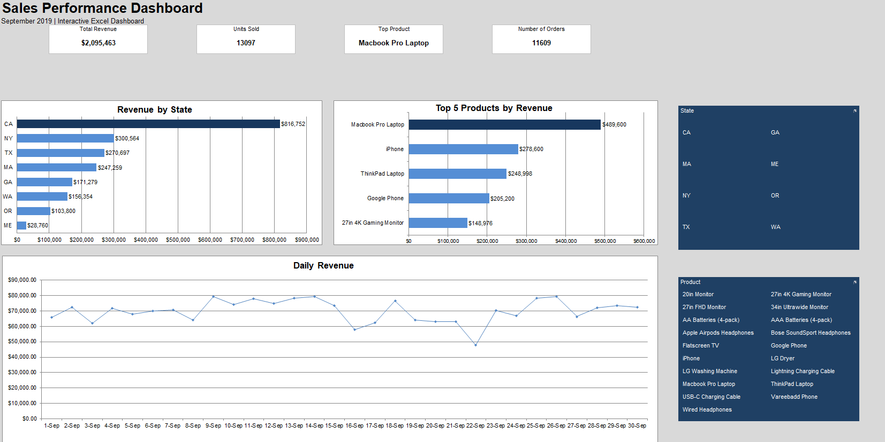

# Portfolio_02_Interactive_Sales_Dashboard
Interactive Sales Dashboard created with Excel

## Project Overview

This project is an interactive sales dashboard created in Microsoft Excel.  
The goal of the project was to analyze sales data and create a clear, interactive dashboard that allows users to explore sales performance
by state and product.

The dataset contains over 11,000 sales records from September 2019.

## Dashboard Features

The dashboard includes four key performance indicators:

- Total Revenue
- Units Sold
- Top Product
- Number of Orders

It also includes three interactive charts:

- Revenue by State
- Top 5 Products by Revenue
- Daily Revenue

Users can filter the dashboard by state and product using interactive slicers.

## Tools and Excel Features Used

- Microsoft Excel
- Pivot Tables
- Pivot Charts
- Slicers
- Excel Tables
- Data Cleaning
- Formulas and Functions
- Dynamic KPI Cards

## Data Cleaning

Before creating the dashboard, the dataset was cleaned and prepared for analysis. This included:

- Removing empty rows
- Checking for missing values
- Correcting date formats
- Converting columns to appropriate data types
- Extracting state information from customer addresses
- Creating a sales value column

## Key Insights

- Total revenue exceeded $2 million.
- Macbook Pro Laptop generated the highest revenue.
- California was the highest-performing state by revenue.
- The dashboard allows users to dynamically analyze sales performance across different states and products.

## Dashboard Preview

## Project Structure

- `Portfolio_02_Interactive_Sales_Dashboard.xlsx` – interactive Excel dashboard
- `dashboard_preview.png` – screenshot of the final dashboard
- `README.md` – project documentation

## About This Project

This project was created as part of my data analytics portfolio to practice data cleaning, sales analysis, Pivot Tables, data visualization, and building
interactive dashboards in Microsoft Excel.